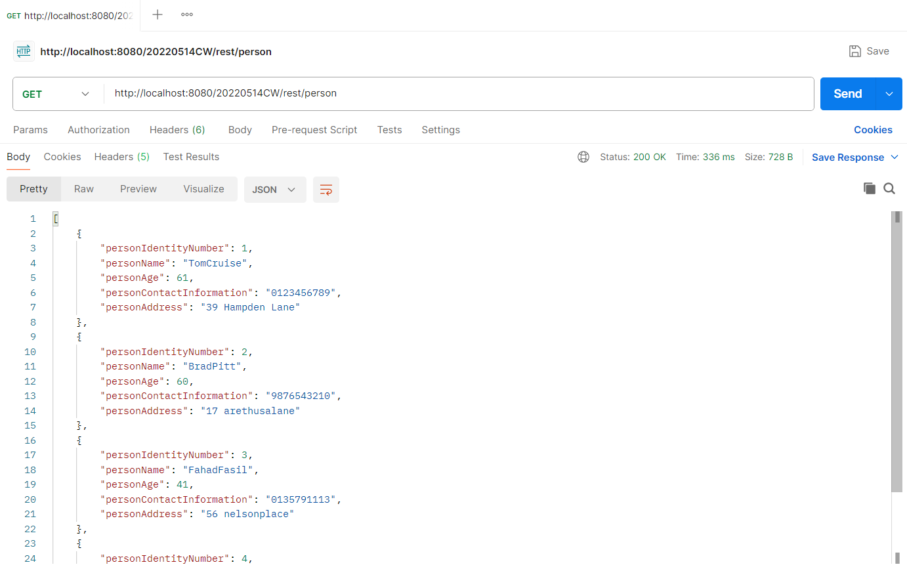

# Health-Management-System

This repository contains a Health Management System using RESTful API

<br>



## Getting Started

The essential procedures required for initiating and configuring the project within your local environment.

### Prerequisites

1. Need to have JDK(Java Development Kit) 19 and NetBeans IDE 18.
2. Need to have Apache Tomcat or TomEE Server.

### Installation

1. Clone the repository and retrieve it onto your local machine.

   ```sh
   git clone https://github.com/Tharanesh-github/Health-Management-System.git
   ```

2. Navigate to the Cloned Repository

   ```sh
   cd Health-Management-System
   ```

3. Start the Apache Tomcat or TomEE Server.

4. Clean and build the application.

5. Run the application.

## License

This repository is distributed under the MIT License. See LICENSE.md for additional information.
